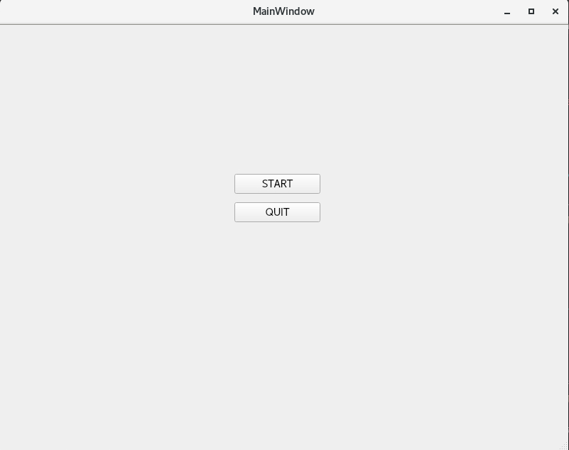
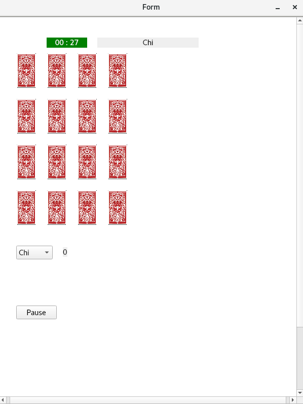
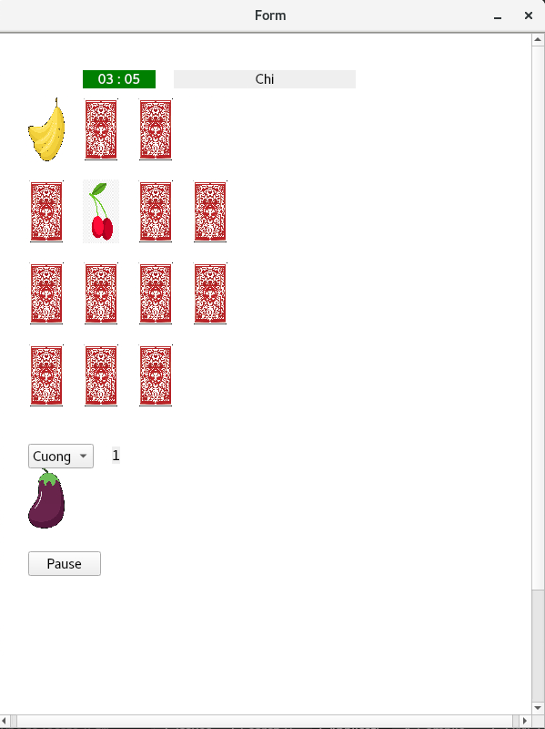
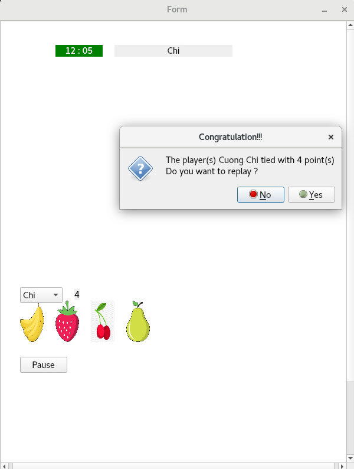

# PAIRS GAME
## How to play
Players need to find identical pairs of cards to achieve points. A player who has the highest point is a winner. You can play maximum with 10 pairs of cards.
Each time a player doesn't find matched cards, a turn of playing is switched into the other player.

## Development
I develop the game based on the final project of 'Programming 2' course in Tampere University. Qt GUI is the main platform - C++ is the main language - to develop the game. All images used in the game is designed by **[Freepik](http://www.freepik.com)**

### Starting Screen

### Info Screen
Players need to type their name and the number of players and pairs of cards they want to play

### Starting a match
There is a counter and an info area which shows how many points and which pairs a in-turn player achieved

### During a match
If an identical pair is discovered, it would be removed from the grid

### Ending of a match
Showing the final winner and his/her points
